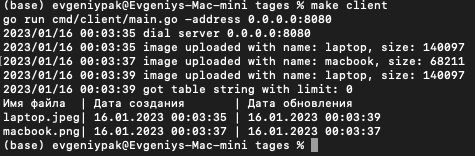

# gRPC service to operate with images

Service can operate with images on disk (upload/download) and can get uploaded images list as table string

(store isn't persistent)

## UploadImage

Uploads Image to the disk (img folder)

## DownloadImage

Downloads Image from the disk (by name (without extension))

## GetUploadedImagesTableString

Forms Table string with uploaded images info in the form:

`Имя файла | Дата создания | Дата обновления`

### Concurrency limiting

Service limits number of concurrent workers on stream methods (Upload and Download) by 10
and on Unary (GetUploadedImagesTableString) by 100
using Stream and Unary ServerInterceptor correspondingly

## What can be done in the future

* Persistent store (using remote disk or Bind mounts + Redis)
* More convenient logs (using logrus)
* Metrics
* More tests
* More security (authentication using JWT or Paseto)